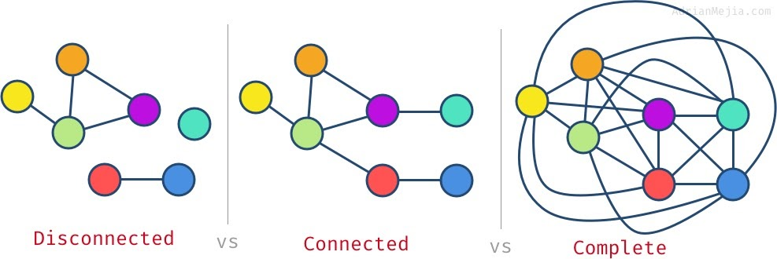
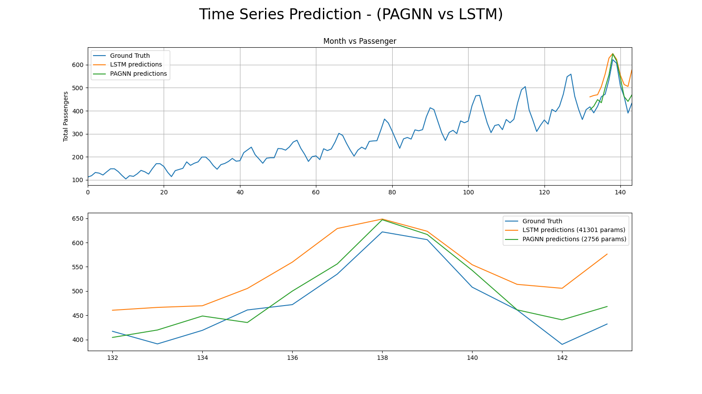
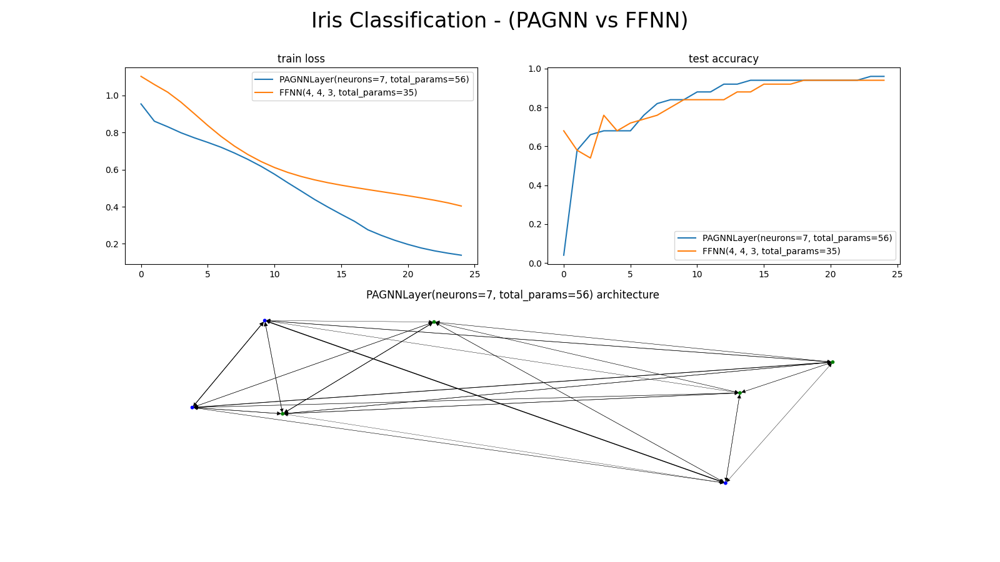
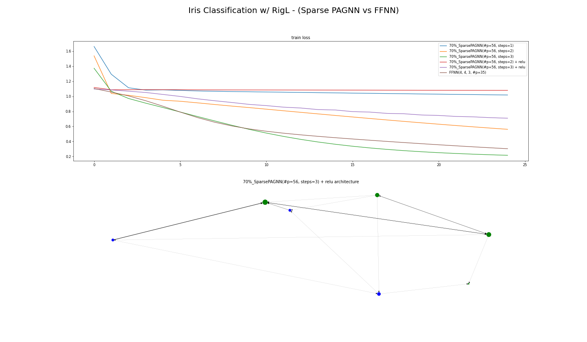
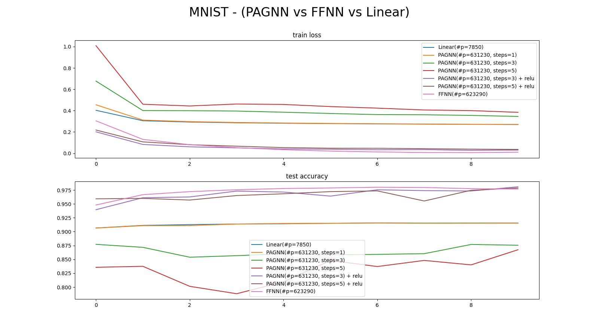
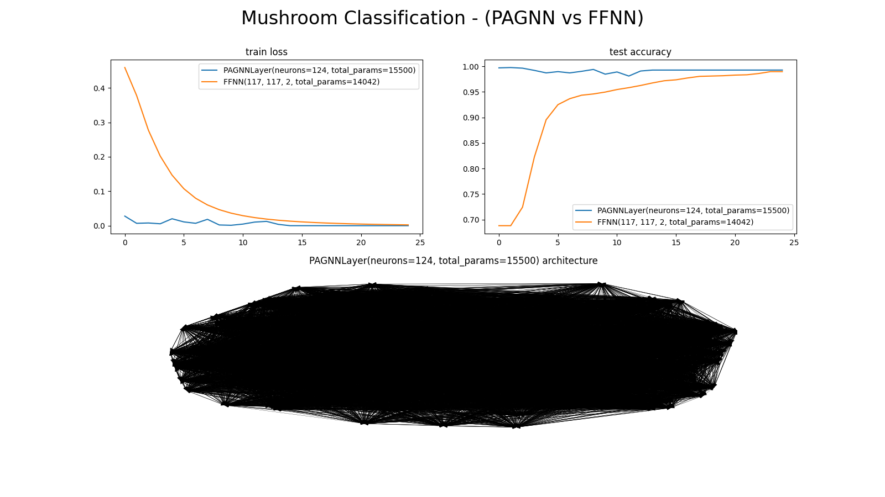

# PAGNNs
##### The unification of AI. Generalize to temporal/non-temporal datasets with 0 API modifications, and (soon to be) 0 architectural hyperparameters.

WARNING: PAGNNs are currently under VERY ACTIVE research. These results & comparisons are very early in it's lifecycle and there is plenty of ground to cover.

This is also the very first fully open source AI research project for my new research company that is powered by [SharpestMinds](https://www.sharpestminds.com/?r=dyllan-mccreary) mentees. If you are interested in being part of my research team, you may reach out to me via `mccreary@dyllan.ai` or you can apply to be my mentee [here](https://app.sharpestminds.com/u/yGyFBQvfv44iG2JC5?r=dyllan-mccreary). If you'd like to see an idea of the types of researchers I'm looking for, the [GitHub Projects](https://github.com/McCrearyD/PAGNNs/projects) or [Issues](https://github.com/McCrearyD/PAGNNs/issues) pages of this repository has a nice list of things to do!

# What are PAGNNs?
 
**PAGNN** stands for **Persistent Artificial Graph-based Neural Networks**.

### Formal Equation:     
<code>st+1 =  σ(stW + b)</code>, where:
- `W` is a square [adjacency matrix](https://en.wikipedia.org/wiki/Adjacency_matrix) of shape `NxN`.
- <code>st</code> is a row vector of shape `1xN`.
- And `N` is the total number of neurons in the network.

**A quick note:** the `σ(...)` function is NOT required to be a nonlinearity. **PAGNNs are special in that they do NOT require an activation function to generalize to nonlinear datasets**. In the case we use no nonlinearity, `σ(...)` becomes an identity function.  More on this [below](#PAGNNs-do-NOT-require-an-activation-function).

### Architecture
- PAGNNs are a stateful artificial neural network architecture that is as general as possible. It is able to operate on temporal & non-temporal datasets with no modifications to the API or architecture. It also has the capacity to significantly outperform in generalizing to both temporal & non-temporal datasets in comparison to Long-Short Term Memory networks (LSTMs) & Feed Forward Neural Networks (FFNNs) respectively.

- They also have a general topology, represented by square [adjacency matrices]([https://en.wikipedia.org/wiki/Adjacency_matrix](https://en.wikipedia.org/wiki/Adjacency_matrix)):
	- The architecture itself makes no assumptions about the topology other than the TOTAL number of neurons. In FFNNs, tons of assumptions are heuristically made about the topology beyond the neuron count including: number of layers, number of neurons per layer, density per layer, and the directionality of dataflow.
	- A fully dense PAGNN is a topological “[complete graph](https://en.wikipedia.org/wiki/Complete_graph)”. This means that every neuron is connected to every other neuron in the network **bi-directionally**, including itself:

- However, PAGNNs do not need to be fully dense! There has been tons of research in sparsity regarding FFNNs, and it has been shown that networks that are sufficiently deep (ex. ResNet50) that are also pruned to have less nonzero weights than a network of similar architecture that is less deep (ex. ResNet18), still outperform their smaller counterparts significantly. In some cases they only suffer from a sub-1% accuracy loss from their base dense architecture, whereas demoting the deeper network to be more shallow, you can suffer significant accuracy loss (Ex. demoting from ResNet50 to ResNet18 on ImageNet loses about 7-9% top-1 accuracy, whereas pruning a ResNet50 to have the same parameter count as ResNet18 can lose sub-1%). However, **I hypothesize that sparsity in PAGNNs can produce results beyond redundancy reduction... But truly more general learners**. In the figure below, the 2 topologies on the left are sparse PAGNNs, and the right is a fully dense PAGNN all with 7 total neurons (nodes):

### More on Sparsity
- It is also worth mentioning that **a FFNN with n neurons, k layers, and dk densities per layer is a special case of a PAGNN network with n neurons**. This applies for all possible values for n, k, and dk. So intuitively a PAGNN topology optimizer could find something similar to a FFNN as one of it’s intermediary solutions.  In other words, FFNNs are pruned PAGNNs.
- So if we prove that a FFNN can generalize better than a fully dense PAGNN in some cases, then we already have our answer: pruned PAGNNs have the potential to outperform dense PAGNNs. According to early experimentation, this seems to be the case. This is very exciting because I hypothesize that the topology is as important as the parameterization of the AI -- if not, more.
- I also hypothesize that it may not even be necessary for the engineer to determine the number of neurons a PAGNN should have. This may also be learned, and is much more trivial with this sort of network in comparison to a FFNN (see [NEAT](https://en.wikipedia.org/wiki/Neuroevolution_of_augmenting_topologies)).

### How are PAGNNs stateful and how do we input/output data? 
- Due to the very arbitrary representation of PAGNNs, it may be hard to understand how we actually provide our input data & return our predictions. It helps to compare PAGNNs to FFNNs: 
	- **FFNNs**: We have some feature column vector `X` that contains our input data. Let’s say we have 2 features we want to operate upon, that means that our first layer’s weight matrix has a dimensionality of `2xN` (remember for FFNNs we always transpose `W` before applying it to our input data, so after transposition it becomes `Nx2`) and our input column vector `X` has a dimensionality of `2x1`. There is nowhere to store these features other than `X`, so we simply take the matrix multiplication between <code>WT</code> & `X` (shapes=`Nx2` & `2x1`). The only “state” a FFNN has is the intermediary calculations between layers. This WTX matmul gives us an output <code>Z0</code> which is the intermediary output for layer 0, this is now the input to layer 1. This is thrown away after a single `X` sample, so FFNNs are not stateful.

	- **Loading `X` into a PAGNN**: We still have some feature column vector `X` containing our input data. Again, we’ll say we have 2 features we want to operate upon, so again `X` is of the shape `2x1`. However, now we introduce the PAGNN’s state variable called <code>st</code>. It is a row vector of shape `1xN`, where `N` is the number of neurons total in the network and is initialized to contain all 0s. `N` must be greater than or equal to the number of input features. Before we can input any data, we must first choose neurons to allocate as input neurons which in this case must be 2 since we have 2 input features in `X`. For simplicity, we will also say that this network has 5 total neurons. Now before we can do anything, we have to load the input features from `X` into <code>st</code>. We do so by simply setting the first 2 elements (technically this can be an arbitrary choice but for simplicity we choose the first 2) in <code>st</code> to the 2 elements in `X`. This is called “loading input”. Now, our <code>st</code> variable has 2 feature values as well as 3 trailing 0s. All parameters in the network are stored in the adjacency matrix "`W`", it is a square matrix with the shape `NxN`. Conceptually `W` represents the weightings between neurons (nodes), where <code>W[i, j]</code> is the weight (or edge value) for the connection between neuron `i` & neuron `j`. To get the next state <code>st+1</code>, we take the matrix multiply between <code>st</code> & `W` (shapes=`1x5` & `5x5`). Conceptually this is the transfer of energy between neurons. For each element in the state vector we basically pass it through the edges in the network, and take the sum of all incoming weighted energies. The output of this operation is `1xN`, or in this case `1x5`, which is the exact shape we started with for <code>st</code>. This output row vector becomes <code>st+1</code>. That completes 1 full PAGNN step.
Extracting predictions from a PAGNN: If we want our output vector `Y` to be a feature vector of size 1, we simply take the <code>st</code> vector (again, of size `1x5`) and pull out the last element. Again, this choice can be arbitrary but for simplicity we pull out the last element!

- **PAGNN input/output caveats**: Technically the number of neurons in a PAGNN can be equal to `max(num_input_features, num_output_features)`. 
	- Although, this means some neurons will double as inputs & outputs. It is unknown if this is useful and is a topic of active research.  Also, depending on the topology of the adjacency matrix `W` & the chosen number of steps, the output neuron’s states may remain 0s even after a number of steps. If the `W`'s topology is [disconnected](https://www.tutorialspoint.com/connected-vs-disconnected-graphs), where some inputs are isolated from some outputs both directly and indirectly, the empty output neurons problem **will necessarily** happen. This is why training PAGNNs can be somewhat cumbersome if done naively. 
	- Fully dense PAGNNs do not suffer from the “empty neurons” problem mentioned above, however they may contain noise/interference, again this is under active research so this is speculative.

### PAGNNs do NOT require an activation function:

- The extent to which PAGNNs are trainable without an activation function is currently unknown. Early experiments show that using an activation function like ReLU applied to the state matrix after each step (<code>st+1 =  σ(stW + b), where σ(...) is a nonlinear activation function</code>) can boost convergence time and reduce exploding gradients/state values, however we may be able to alleviate this with more intelligent topology pruning & weight initialization.
 - Normal FFNNs without an activation function can only perform linear regression. Analyzing the formal math equation for the input layer of a neural network without a nonlinearity, it becomes apparent why: <code>Z0 = W0TX + b0</code> -- All that is happening here is some multiplies and some additions. It is a linear transformation of `X` parameterized by <code>W0</code> & <code>b0</code>. If this has 2 layers with no activation, the second layer’s math equation is as follows: <code>Z1 = W1TZ0 + b1</code>. So, our data has gone through 2 successive linear transformations parameterized by <code>W0-1</code> & <code>b0-1</code>. This is strictly linear.
- PAGNNs on the other hand are a parameterized recursive function with only 1 weight “layer”: <code>st+1 =  stW + b</code>, where `W` is a square adjacency matrix -- this has the potential to be nonlinear, however it depends on a couple factors:
	1. For our initial state <code>s0</code> we would need to make more than 1 step. A step is defined as a single call of this recursive function.
	2. The topology of the `W` adjacency matrix has to contain node recurrency either directly or indirectly. If the recurrency is indirect, this may require a number of steps greater than what we would expect for a complete graph topology.

### Training PAGNNs:

- After extracting our predicted values in the previous section, we can calculate the loss. PyTorch makes this very easy as it builds a dynamic compute graph that allows us to backpropagate the error. Then, we simply call the optimizer's step function!
- More on this coming soon.

**Note: In the current state of the repository, PAGNNs are fully dense. I hypothesize that significantly large, but also sparse PAGNNs can perform significantly better.**

## Environment Setup:

1. Clone this repository.
2. `cd path/to/cloned/PAGNNs/`
3. `python -m venv env`
4. `source env/bin/activate`
5. `pip install -e .`

## Comparisons:

### Time Series Prediction:
[Source Code](examples/time_series.py)

Observe the "param" count in the visualization's legend. **The PAGNN here only has 156 parameters and outperforms the LSTM with 41,301 parameters by a very significant amount**. This is using the same LR & same # epochs. This PAGNN is fully dense.

A quick note here, increasing PAGNNs neuron count count doesn't necessarily increase performance, in some cases it can reduce it. This is most likely due to the quadratic increase in noise as you increase the number of neurons. **I hypothesize that sparse training will reduce the amount of noise and boost performance by an extreme amount in comparison to fully dense PAGNNs if executed correctly**.

### Iris Classification:
[Source Code](examples/iris_classification.py)

### Iris Classification Sparse (w/ [RigL](https://github.com/McCrearyD/rigl-torch)):
[Source Code](examples/sparse_iris_classification.py)

### MNIST:
[Source Code](examples/mnist.py)

### Mushroom Classification:
[Source Code](examples/mushroom_classification.py)

<!--stackedit_data:
eyJoaXN0b3J5IjpbLTIwMDM3NTk0NTEsMzY3NjM3NjE2XX0=
-->
