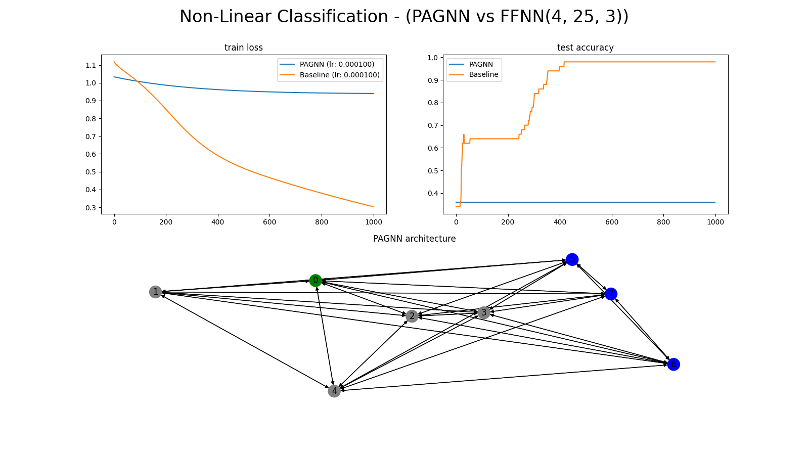
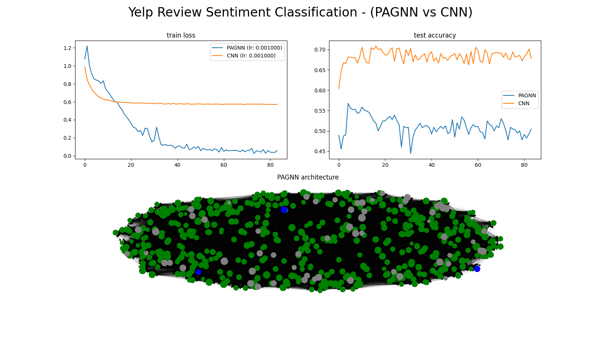

# Persistent Artificial Graph-based Neural Networks (PAGNNs)

## Environment Setup:

1. Clone this repository.
2. `cd path/to/cloned/PAGNNs/`
3. `python3 -m venv pagnn_env`
4. `source pagnn_env/bin/activate`
5. `pip install -e .`

## Showcase:

### Feature-Fed Comparisons:


### Sequence-Fed Comparisons:

**Note:** Baseline comparisons (non-PAGNN models) are fed data as you would expect, each feature contained in a single vector. However, the difference between this section and the previous lies in that the PAGNN data is fed temporally (despite the datasets having no temporal aspect). 

That means, instead of feeding the PAGNN the data as a feature vector, it is fed one feature scalar at a time.

For example, a FFNN would be fed data as a feature vector:
```
x = [1, 5, 1, 0.5, 1, 6] # 6 features
y = ffnn(x)
```

But the PAGNN would be fed data as a sequence:
```
x = [1, 5, 1, 0.5, 1, 6] # again, 6 features
for feature in x:
    pagnn.load_input_neurons(feature)
    pagnn.step()
y = pagnn.extract_output_neurons()
```
**WARNING: The code above will NOT run. It is simplified for ease of explanation.**




### NLP Comparisons:



## Datasets Credit:
- Linear Regression: `datasets/linear_regression/` [source](https://www.kaggle.com/andonians/random-linear-regression)
- Multi-Variate Linear Regression: `datasets/mv_linear_regression/` [source](https://www.kaggle.com/mirichoi0218/insurance)
- Non-Linear Classification: `datasets/non_linear_classification/` [source](https://www.kaggle.com/uciml/iris)
- Mushroom Classification (not linearly separable): `datasets/mushroom_classification/` [source](https://www.kaggle.com/uciml/mushroom-classification)
- Yelp Sentiment Classification (not linearly separable): `datasets/yelp/` [source](https://www.yelp.com/dataset)
