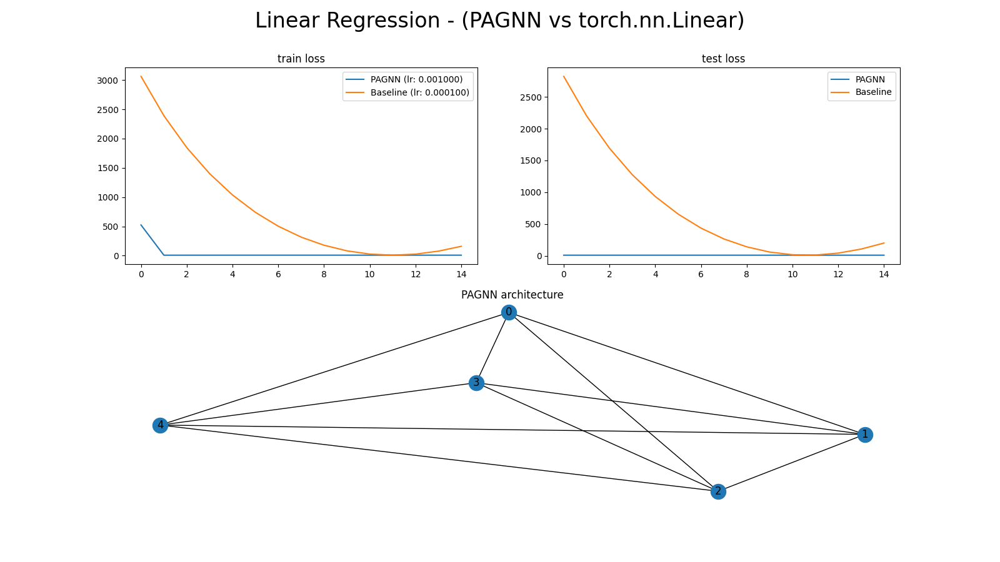
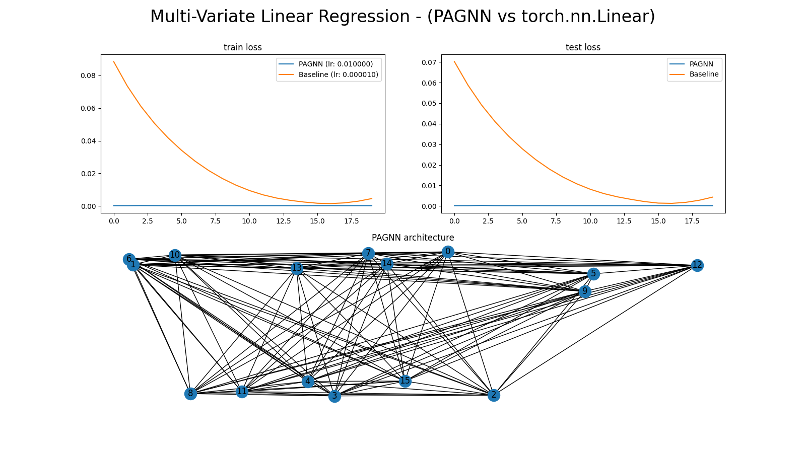
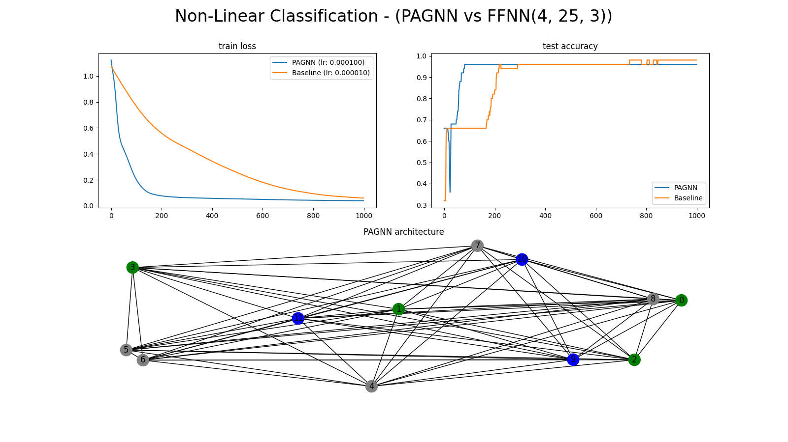
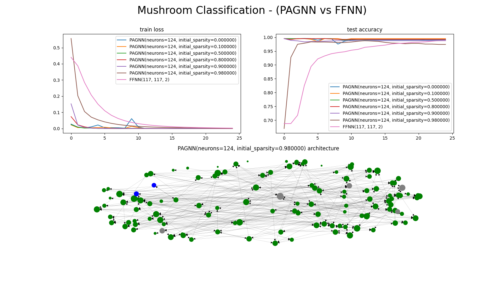
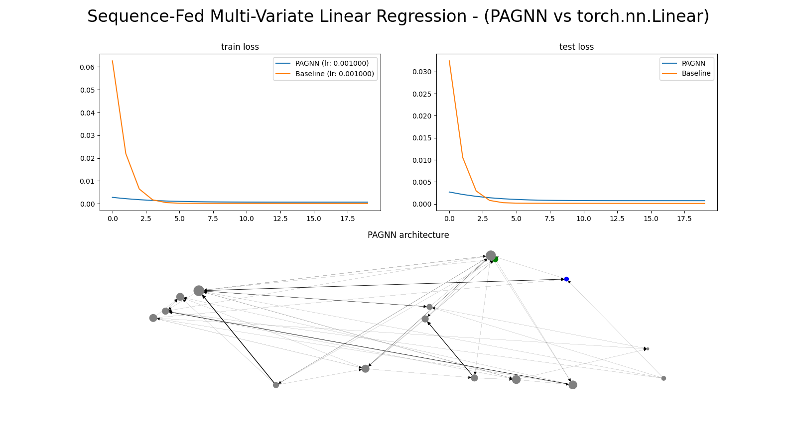

# Persistent Artificial Graph-based Neural Networks (PAGNNs)

## Environment Setup:
1. Clone this repository.
2. `cd path/to/cloned/PAGNNs/`
3. `python3 -m venv pagnn_env`
4. `source pagnn_env/bin/activate`
5. `pip install -e .`

## Showcase:
### Feature-Fed Comparisons:

### Sequence-Fed Comparisons:

## Datasets Credit:
- Linear Regression: `datasets/linear_regression/` [source](https://www.kaggle.com/andonians/random-linear-regression)
- Multi-Variate Linear Regression: `datasets/mv_linear_regression/` [source](https://www.kaggle.com/mirichoi0218/insurance)
- Non-Linear Classification: `datasets/non_linear_classification/` [source](https://www.kaggle.com/uciml/iris)
- Mushroom Classification (also not linearly separable): `datasets/mushroom_classification/` [source](https://www.kaggle.com/uciml/mushroom-classification)
